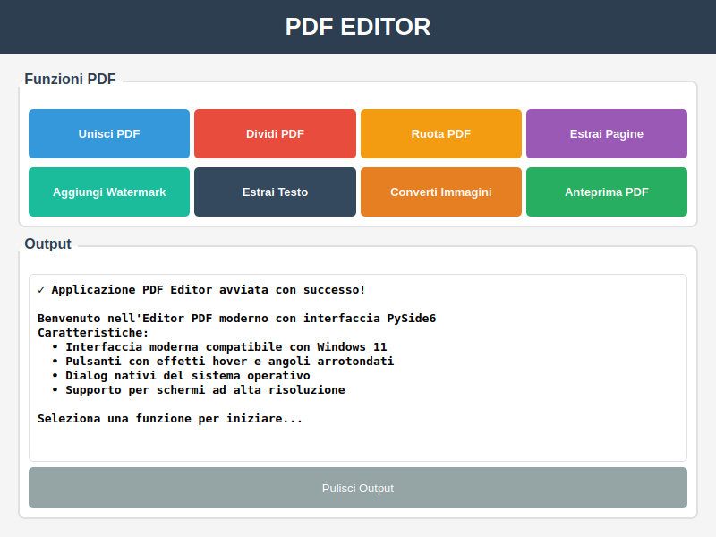

# PDF Editor - Applicazione Desktop Python

[](CHANGELOG.md)
[](https://www.python.org/downloads/)
[](LICENSE)
[](https://www.microsoft.com/windows)
[-brightgreen.svg)](https://www.qt.io/qt-for-python)
[](CONTRIBUTING.md)

Una potente applicazione desktop per modificare file PDF sviluppata in Python con interfaccia grafica moderna basata su **PySide6 (Qt)**, completamente compatibile con Windows 11.

> **✨ Caratteristiche principali**: Interfaccia moderna Windows 11 • Operazioni PDF complete • Supporto alta risoluzione • Open Source MIT

| Interfaccia Moderna | Con Contenuto |
|:-------------------:|:-------------:|
|  |  |

## 📑 Indice

- [Quick Start](#-quick-start)
- [Funzionalità Principali](#-funzionalità-principali)
- [Requisiti di Sistema](#-requisiti-di-sistema)
- [Installazione](#-installazione)
- [Utilizzo](#-utilizzo)
- [Struttura del Progetto](#️-struttura-del-progetto)
- [Tecnologie Utilizzate](#-tecnologie-utilizzate)
- [Prestazioni e Suggerimenti](#-prestazioni-e-suggerimenti)
- [Risoluzione dei Problemi](#-risoluzione-dei-problemi)
- [Roadmap](#-roadmap-e-aggiornamenti-futuri)
- [FAQ](#-domande-frequenti-faq)
- [Sicurezza e Privacy](#-sicurezza-e-privacy)
- [Contribuzioni](#-contribuzioni)
- [Supporto](#-supporto)
- [Licenza](#-licenza)

---

## 📚 Documentazione Aggiuntiva

- **[CONTRIBUTING.md](CONTRIBUTING.md)** - Guida completa per contribuire al progetto
- **[CHANGELOG.md](CHANGELOG.md)** - Cronologia delle modifiche e versioni
- **[README_PRO.md](README_PRO.md)** - Documentazione approfondita versione Pro
- **[GUIDA_RAPIDA.md](GUIDA_RAPIDA.md)** - Guida rapida funzionalità Pro
- **[ISTRUZIONI_AVVIO.md](ISTRUZIONI_AVVIO.md)** - Istruzioni dettagliate per avviare l'applicazione
- **[MIGRATION_NOTES.md](MIGRATION_NOTES.md)** - Note tecniche sulla migrazione a PySide6
- **[TEMA_AUTOMATICO.md](TEMA_AUTOMATICO.md)** - ✨ Guida al tema chiaro/scuro automatico

---

## 🚀 Quick Start

```bash
# 1. Clona il repository
git clone https://github.com/FrancescoZanti/PDF---Editor.git
cd PDF---Editor

# 2. Installa le dipendenze
pip install -r requirements.txt

# 3. Avvia l'applicazione
python pdf_editor.py
# oppure doppio click su avvia_pdf_editor.bat
```

> **💡 Suggerimento**: Per funzionalità avanzate (annotazioni, form, sicurezza), usa `python pdf_editor_pro.py`

## 🚀 Funzionalità Principali

### Funzioni Base
- **Unione PDF** - Combina più file PDF in un singolo documento
- **Divisione PDF** - Dividi PDF in pagine singole o per intervalli specifici
- **Rotazione PDF** - Ruota le pagine di 90°, 180° o 270°
- **Estrazione Pagine** - Estrai pagine specifiche da un PDF
- **Watermark** - Aggiungi filigrane di testo ai tuoi PDF
- **Estrazione Testo** - Estrai tutto il testo da un PDF in formato .txt
- **Conversione Immagini** - Converti immagini (JPG, PNG, BMP, etc.) in PDF
- **Anteprima PDF** - Visualizza i PDF con l'applicazione predefinita del sistema

### ✨ Nuove Funzionalità
- **🌗 Tema Chiaro/Scuro Automatico** - L'interfaccia si adatta automaticamente al tema di sistema di Windows 10/11
  - Supporto completo per modalità chiara e scura
  - Rilevamento automatico dalle impostazioni di Windows
  - Possibilità di forzare manualmente il tema preferito
  - Vedi [TEMA_AUTOMATICO.md](TEMA_AUTOMATICO.md) per maggiori dettagli

## 🔧 Requisiti di Sistema

### Requisiti Minimi

| Componente | Requisito Minimo | Raccomandato |
|------------|------------------|--------------|
| **Sistema Operativo** | Windows 10 (64-bit) | Windows 11 (64-bit) |
| **Python** | 3.8.0 | 3.11.0 o superiore |
| **RAM** | 2 GB | 8 GB |
| **Spazio Disco** | 200 MB | 500 MB |
| **Risoluzione Schermo** | 1366 x 768 | 1920 x 1080 (Full HD) |
| **Processore** | Intel/AMD Dual-core | Intel/AMD Quad-core |

### Software Aggiuntivo

#### Obbligatori
- **Python 3.8+** - [Scarica da python.org](https://www.python.org/downloads/)
  - ⚠️ Durante l'installazione, seleziona "Add Python to PATH"

#### Opzionali (per funzionalità specifiche)
- **Lettore PDF** (per funzione Anteprima)
  - Adobe Acrobat Reader DC (consigliato)
  - Microsoft Edge (integrato in Windows)
  - Foxit Reader o altri
  
- **Poppler** (per conversione PDF in immagini)
  - Automaticamente gestito da pdf2image
  - Windows: Scarica binary da [poppler releases](https://github.com/oschwartz10612/poppler-windows/releases/)

### Note sulla Compatibilità

- ✅ **Windows 10**: Completamente supportato
- ✅ **Windows 11**: Completamente supportato con UI ottimizzata
- ⚠️ **Windows 8.1 e precedenti**: Non testato, potrebbe funzionare
- ❌ **Windows 7**: Non supportato ufficialmente (manca supporto PySide6)
- 💡 **macOS/Linux**: PySide6 è cross-platform, ma l'app è ottimizzata per Windows

## 📦 Installazione

### Metodo 1: Installazione Automatica (Raccomandato)

#### Passo 1: Scarica il Progetto

**Opzione A - Con Git:**
```bash
# Clona il repository
git clone https://github.com/FrancescoZanti/PDF---Editor.git

# Entra nella cartella
cd PDF---Editor
```

**Opzione B - Download ZIP:**
1. Vai su [GitHub](https://github.com/FrancescoZanti/PDF---Editor)
2. Clicca su "Code" → "Download ZIP"
3. Estrai il file ZIP
4. Apri il terminale nella cartella estratta

#### Passo 2: Installa le Dipendenze

```bash
# Installa tutte le dipendenze automaticamente
pip install -r requirements.txt
```

**Tempo stimato**: 2-5 minuti (dipende dalla velocità della connessione)

#### Passo 3: Verifica l'Installazione

```bash
# Esegui il test diagnostico
python test_simple.py
```

**Output atteso:**
```
✓ Import main: OK
✓ Funzione main: OK
✓ Classe PDFEditor: OK
✓ Tutti i test superati!
```

### Metodo 2: Installazione Manuale

Se preferisci installare le dipendenze una per una:

**Dipendenze Base:**
```bash
pip install PySide6        # Framework UI moderno
pip install pypdf          # Manipolazione PDF
pip install pillow         # Gestione immagini
pip install pdf2image      # Conversione PDF->immagini
pip install reportlab      # Creazione PDF e watermark
```

**Dipendenze Pro (opzionali):**
```bash
pip install PyMuPDF        # Editing PDF avanzato
pip install cryptography   # Crittografia
pip install numpy          # Elaborazione numerica
pip install opencv-python  # Computer vision
pip install matplotlib     # Grafici
```

### Metodo 3: Ambiente Virtuale (Best Practice per Sviluppatori)

```bash
# Crea un ambiente virtuale
python -m venv venv

# Attiva l'ambiente virtuale
# Su Windows:
venv\Scripts\activate
# Su Linux/Mac:
source venv/bin/activate

# Installa le dipendenze nell'ambiente virtuale
pip install -r requirements.txt

# Quando hai finito, disattiva l'ambiente
deactivate
```

### Risoluzione Problemi di Installazione

#### ❌ Errore "pip: command not found"
```bash
# Prova con:
python -m pip install -r requirements.txt
# oppure
py -m pip install -r requirements.txt
```

#### ❌ Errore di permessi su Windows
```bash
# Esegui il terminale come Amministratore
# oppure usa --user:
pip install --user -r requirements.txt
```

#### ❌ Timeout durante il download
```bash
# Aumenta il timeout:
pip install --timeout=300 -r requirements.txt
```

#### ❌ Conflitti di versione
```bash
# Aggiorna pip prima:
python -m pip install --upgrade pip

# Poi reinstalla:
pip install -r requirements.txt
```

## 🎯 Utilizzo

### Avvio dell'Applicazione

Esegui l'applicazione usando uno di questi metodi:

**Metodo 1 (Più Semplice):**
```bash
# Doppio click su:
avvia_pdf_editor.bat
```

**Metodo 2 (Raccomandato):**
```bash
# Tasto destro → "Esegui con PowerShell":
Avvia_PDF_Editor.ps1
```

**Metodo 3 (Terminale):**
```bash
python pdf_editor.py
```

**Metodo 4 (Sviluppatori):**
```bash
cd src
python main.py
```

### Interfaccia Utente

L'applicazione presenta un'interfaccia grafica moderna e intuitiva con:

- **Pulsanti delle funzioni** - 8 pulsanti colorati con effetti hover per le diverse operazioni
- **Area di output** - Mostra i risultati e i messaggi delle operazioni in tempo reale
- **Design moderno Windows 11** - Interfaccia pulita con angoli arrotondati, ombre e animazioni fluide
- **Temi Qt nativi** - Supporto per i temi del sistema operativo
- **Interfaccia responsive** - Si adatta a diverse risoluzioni dello schermo

### Esempi di Utilizzo

#### Unire più PDF
1. Clicca su "Unisci PDF"
2. Seleziona 2 o più file PDF
3. Scegli il nome del file di output
4. L'operazione verrà completata automaticamente

#### Dividere un PDF
1. Clicca su "Dividi PDF"
2. Seleziona il file PDF da dividere
3. Scegli tra:
   - **Pagine singole** - Ogni pagina diventa un file separato
   - **Intervallo** - Specifica pagina iniziale e finale
4. Seleziona la cartella di output

#### Aggiungere Watermark
1. Clicca su "Aggiungi Watermark"
2. Seleziona il PDF
3. Inserisci il testo del watermark
4. Salva il file con watermark

## 🗂️ Struttura del Progetto

```
PDF-Editor/
├── 📂 src/                          # Codice sorgente principale
│   ├── main.py                      # Applicazione base (PySide6)
│   ├── pdf_manager.py               # Gestore operazioni PDF base
│   ├── ui_components.py             # Componenti UI moderne
│   ├── acrobat_like_gui.py          # Interfaccia stile Acrobat (Pro)
│   ├── advanced_pdf_editor.py       # Engine editing avanzato (Pro)
│   ├── pdf_form_editor.py           # Editor form interattivi (Pro)
│   ├── pdf_security.py              # Sicurezza e crittografia (Pro)
│   └── user_config.py               # Gestione configurazione utente
│
├── 📂 assets/                       # Risorse dell'applicazione
│   ├── pyside6_modern_ui.png        # Screenshot interfaccia moderna
│   └── pyside6_with_content.png     # Screenshot con contenuto
│
├── 📂 output/                       # Cartella output predefinita (creata automaticamente)
│
├── 📄 pdf_editor.py                 # 🚀 Launcher versione BASE
├── 📄 pdf_editor_pro.py             # 🚀 Launcher versione PRO
├── 🪟 avvia_pdf_editor.bat          # Script avvio Windows (Base)
├── 🪟 avvia_pdf_editor_pro.bat      # Script avvio Windows (Pro)
├── ⚡ Avvia_PDF_Editor.ps1          # Script PowerShell (Base)
│
├── 📋 requirements.txt              # Dipendenze Python
├── 📖 README.md                     # Questa documentazione
├── 📖 README_PRO.md                 # Documentazione versione Pro
├── 📘 GUIDA_RAPIDA.md               # Guida rapida funzionalità Pro
├── 📗 ISTRUZIONI_AVVIO.md           # Istruzioni dettagliate avvio
├── 📙 MIGRATION_NOTES.md            # Note sulla migrazione a PySide6
│
├── 🧪 test_simple.py                # Test diagnostici
├── 🧪 test_pdf_editor.py            # Test suite
│
├── ⚙️ config.ini                    # File configurazione
└── 📜 LICENSE                       # Licenza MIT
```

### Descrizione Cartelle e File Principali

- **src/** - Tutto il codice Python dell'applicazione
  - `main.py` - Entry point della versione base con interfaccia PySide6
  - `pdf_manager.py` - Logica di business per operazioni PDF (unisci, dividi, etc.)
  - `ui_components.py` - Widget e componenti UI riutilizzabili
  - File `*_pro.py` - Moduli avanzati per la versione Pro

- **assets/** - Immagini, icone e risorse statiche
  
- **Launcher scripts** - Vari modi per avviare l'applicazione
  - `.py` - Script Python diretti
  - `.bat` - Batch script per Windows
  - `.ps1` - PowerShell script (raccomandato per Windows)

- **Documentazione** - File `.md` con guide e istruzioni

## 🔧 Tecnologie Utilizzate

### Framework e Librerie Principali

- **Python 3.8+** - Linguaggio di programmazione principale
- **PySide6 (Qt 6)** - Framework moderno per l'interfaccia grafica con supporto nativo Windows 11
- **pypdf** - Libreria per la manipolazione dei PDF (merge, split, rotate)
- **Pillow (PIL)** - Gestione e elaborazione delle immagini
- **reportlab** - Creazione di PDF da zero e aggiunta watermark
- **pdf2image** - Conversione PDF in immagini per anteprima

### Librerie Avanzate (versione Pro)

- **PyMuPDF (fitz)** - Engine PDF avanzato per editing visuale
- **cryptography** - Crittografia e sicurezza documenti
- **numpy** - Elaborazione numerica per immagini
- **opencv-python** - Computer vision (preparazione OCR)
- **matplotlib** - Grafici e visualizzazioni

### Perché PySide6?

- ✅ **Interfaccia moderna** - Look and feel nativo di Windows 11 con Material Design
- ✅ **Performance superiori** - Rendering hardware-accelerated più veloce e fluido
- ✅ **Temi avanzati** - Supporto completo per temi scuri/chiari e personalizzazione CSS
- ✅ **Scalabilità DPI** - Supporto nativo per schermi ad alta risoluzione (4K, 8K, Retina)
- ✅ **Cross-platform** - Codice portabile su Windows, macOS e Linux
- ✅ **Manutenzione attiva** - Qt6 attivamente sviluppato e supportato da Qt Company
- ✅ **Ricco ecosistema** - Migliaia di widget e componenti pronti all'uso
- ✅ **Accessibilità** - Supporto completo per screen reader e tecnologie assistive

## ⚡ Prestazioni e Suggerimenti

### Ottimizzazione per File Grandi

- **File PDF >50MB**: L'elaborazione può richiedere più tempo. Pazienza! ⏳
- **Molte pagine**: Le operazioni di divisione su PDF con 100+ pagine richiedono più memoria
- **RAM consigliata**: 8GB per operazioni su file molto grandi
- **Chiudi altre applicazioni**: Libera risorse se l'elaborazione è lenta

### Suggerimenti per Prestazioni Ottimali

💡 **Usa file di dimensioni ragionevoli**
   - Dividi PDF molto grandi in sezioni più piccole prima di elaborarli
   - Comprimi immagini ad alta risoluzione prima di convertirle in PDF

💡 **Organizza i tuoi file**
   - Mantieni file di input e output in cartelle separate
   - Usa nomi di file descrittivi e senza caratteri speciali

💡 **Batch operations**
   - Per più file, considera di elaborarli in gruppi più piccoli
   - Chiudi e riapri l'applicazione tra batch molto grandi

💡 **Monitor delle risorse**
   - Apri Task Manager (Ctrl+Shift+Esc) per monitorare utilizzo CPU e RAM
   - Se l'app usa >2GB RAM costantemente, riavviala

### Scorciatoie da Tastiera (versione Pro)

| Scorciatoia | Azione |
|-------------|--------|
| `Ctrl + O` | Apri file PDF |
| `Ctrl + S` | Salva modifiche |
| `Ctrl + Shift + S` | Salva con nome |
| `Ctrl + Z` | Annulla ultima azione |
| `Ctrl + Y` | Ripeti azione |
| `Ctrl + Q` | Esci dall'applicazione |
| `Ctrl + Rotella Mouse` | Zoom in/out |
| `F5` | Aggiorna visualizzazione |
| `Esc` | Annulla operazione corrente |

## 🐛 Risoluzione dei Problemi

### Problemi Comuni

#### ❌ Errore "ModuleNotFoundError"
**Sintomo**: L'applicazione non si avvia con errore di moduli mancanti.

**Soluzione**:
```bash
# Metodo 1: Installazione automatica
pip install -r requirements.txt

# Metodo 2: Installazione manuale delle dipendenze principali
pip install PySide6 pypdf pillow pdf2image reportlab
```

**Verifica installazione**:
```bash
python test_simple.py
```

#### ❌ Errore durante l'apertura dell'anteprima
**Sintomo**: Il pulsante "Anteprima PDF" non apre il file.

**Soluzione**:
1. Assicurati di avere un lettore PDF installato:
   - Windows: Adobe Acrobat Reader, Microsoft Edge, o Foxit Reader
2. Verifica che il lettore PDF sia impostato come applicazione predefinita per i file .pdf
3. Controlla che il file PDF non sia corrotto

#### ❌ Problemi con caratteri speciali nei nomi dei file
**Sintomo**: Errori durante il salvataggio o l'apertura di file con caratteri speciali.

**Soluzione**:
- Evita questi caratteri nei nomi dei file: `< > : " / \ | ? *`
- Usa solo lettere, numeri, spazi, trattini e underscore
- Esempio corretto: `documento_unito_2024.pdf`

#### ❌ Errore "Permission denied" durante il salvataggio
**Sintomo**: Non è possibile salvare i file PDF generati.

**Soluzione**:
1. Verifica di avere i permessi di scrittura nella cartella di destinazione
2. Chiudi tutti i lettori PDF che potrebbero avere il file aperto
3. Prova a salvare in una cartella diversa (es. Desktop o Documenti)
4. Esegui l'applicazione come amministratore se necessario

#### ❌ L'interfaccia non si visualizza correttamente
**Sintomo**: Finestra troppo piccola, testo tagliato, o layout distorto.

**Soluzione**:
1. Verifica la risoluzione dello schermo (minimo 1366x768 raccomandato)
2. Controlla le impostazioni di scaling di Windows (100-150% raccomandato)
3. Aggiorna i driver della scheda grafica
4. Reinstalla PySide6: `pip install --upgrade --force-reinstall PySide6`

### Log degli Errori

L'applicazione mostra tutti i messaggi di errore nell'area di output in fondo alla finestra. In caso di problemi:

1. **Leggi attentamente** il messaggio di errore nell'area di output
2. **Controlla** che i file PDF non siano danneggiati o protetti da password
3. **Verifica** di avere i permessi per scrivere nella cartella di output
4. **Consulta** questa sezione per soluzioni specifiche
5. **Se il problema persiste**, apri una issue su GitHub con:
   - Versione di Python (`python --version`)
   - Versione del sistema operativo
   - Messaggio di errore completo
   - Passi per riprodurre il problema

## 🔄 Roadmap e Aggiornamenti Futuri

### Versione 3.1 - In Sviluppo 🚧
- [ ] **Compressione PDF intelligente** - Riduzione dimensione file mantenendo la qualità
- [ ] **Batch Processing** - Elaborazione multipla di file PDF
- [ ] **Anteprima integrata** - Visualizzazione PDF direttamente nell'applicazione
- [ ] **Drag & Drop** - Trascinamento file nell'interfaccia
- [ ] **Storia recenti** - Lista ultimi file elaborati

### Versione 3.2 - Pianificata 📅
- [ ] **OCR integrato** - Riconoscimento testo da immagini in PDF
- [ ] **Tema scuro** - Supporto per dark mode
- [ ] **Esportazione multi-formato** - DOCX, TXT, HTML
- [ ] **Confronto PDF** - Visualizza differenze tra due PDF
- [ ] **Segnalibri e indice** - Gestione segnalibri PDF

### Versione 4.0 - Visione futura 🔮
- [ ] **Plugin system** - Estensioni e plugin di terze parti
- [ ] **Cloud sync** - Sincronizzazione con servizi cloud (Google Drive, OneDrive)
- [ ] **Collaborazione** - Condivisione e editing collaborativo
- [ ] **App mobile companion** - Versione mobile per iOS/Android
- [ ] **API REST** - Integrazione con altri software

### Suggerimenti e Richieste
Hai un'idea per una nuova funzionalità? [Apri una feature request](https://github.com/FrancescoZanti/PDF---Editor/issues/new) su GitHub!

## 🔒 Sicurezza e Privacy

### Elaborazione Locale

- ✅ **Tutti i file vengono elaborati localmente** sul tuo computer
- ✅ **Nessun caricamento su server esterni** - la tua privacy è garantita
- ✅ **Nessun tracciamento o analytics** - non raccogliamo dati degli utenti
- ✅ **Open source** - Puoi ispezionare il codice sorgente liberamente

### Gestione dei File

- I file PDF vengono letti e scritti solo sulle cartelle che specifichi
- L'applicazione non modifica mai i file originali (salvo esplicita scelta dell'utente)
- I file di output vengono creati in nuove posizioni per preservare gli originali

### Dipendenze di Terze Parti

Tutte le librerie utilizzate sono open source e verificate:
- Installate tramite PyPI (Python Package Index)
- Regolarmente aggiornate per sicurezza
- Nessuna libreria sospetta o non verificata

### Versione Pro - Funzionalità di Sicurezza

La versione Pro include funzionalità avanzate di sicurezza:
- **Crittografia PDF** con algoritmi standard del settore
- **Password protection** per documenti sensibili
- **Controllo permessi** per limitare azioni sul PDF
- **Rimozione metadati** per privacy avanzata

**Nota**: Le password e chiavi di crittografia non vengono mai salvate dall'applicazione.

## 📝 Licenza

Questo progetto è rilasciato sotto **licenza MIT**. 

### Cosa significa?

- ✅ **Uso commerciale** - Puoi usarlo nei tuoi progetti commerciali
- ✅ **Modifica** - Puoi modificare il codice come preferisci
- ✅ **Distribuzione** - Puoi distribuire copie modificate o originali
- ✅ **Uso privato** - Puoi usarlo per qualsiasi scopo personale
- ⚠️ **Limitazione di responsabilità** - Il software è fornito "così com'è"
- ⚠️ **Nessuna garanzia** - Gli autori non sono responsabili per eventuali danni

Vedi il file [LICENSE](LICENSE) per i dettagli completi del testo legale.

## 👨‍💻 Sviluppatore

**Francesco Zanti** - Ideatore e sviluppatore principale

Sviluppato con ❤️ per Windows

## 🙏 Ringraziamenti

Questo progetto non sarebbe stato possibile senza:

### Librerie e Framework
- **[PySide6](https://www.qt.io/qt-for-python)** - Framework UI moderno basato su Qt
- **[pypdf](https://github.com/py-pdf/pypdf)** - Manipolazione PDF in Python
- **[PyMuPDF](https://pymupdf.readthedocs.io/)** - Engine PDF avanzato per editing
- **[Pillow](https://python-pillow.org/)** - Libreria di elaborazione immagini
- **[ReportLab](https://www.reportlab.com/)** - Generazione PDF professionale

### Community
- Tutti i **contributori** che hanno migliorato il progetto
- La **community Python** per le eccellenti librerie
- Gli utenti che hanno segnalato bug e suggerito funzionalità
- I **maintainer open source** che ispirano questo progetto

### Ispirazione
- **Adobe Acrobat DC** - Per il design dell'interfaccia Pro
- **PDF-XChange Editor** - Per le funzionalità di annotazione
- **PDFtk** - Per gli approcci alle operazioni PDF

## 🌟 Stella il Progetto

Se questo progetto ti è stato utile, considera di dargli una stella ⭐ su GitHub!

Aiuta altri a scoprire PDF Editor e supporta lo sviluppo continuo.

[](https://github.com/FrancescoZanti/PDF---Editor)

---

<p align="center">
  <strong>Realizzato con ❤️ e Python</strong>
  <br>
  <em>Open Source • Free Forever • Community Driven</em>
</p>

## 🤝 Contribuzioni

I contributi sono benvenuti! Questo progetto segue le best practice della community open source.

### Come Contribuire

1. **Fork del progetto** su GitHub
2. **Clona** il tuo fork in locale:
   ```bash
   git clone https://github.com/tuo-username/PDF---Editor.git
   cd PDF---Editor
   ```
3. **Crea un branch** per la tua funzionalità:
   ```bash
   git checkout -b feature/nome-funzionalità
   ```
4. **Installa** le dipendenze di sviluppo:
   ```bash
   pip install -r requirements.txt
   ```
5. **Sviluppa** la tua funzionalità seguendo le linee guida del codice
6. **Testa** le modifiche:
   ```bash
   python test_simple.py
   python pdf_editor.py  # Test manuale
   ```
7. **Committa** le modifiche con messaggi descrittivi:
   ```bash
   git add .
   git commit -m "Add: nuova funzionalità X"
   ```
8. **Push** al tuo fork:
   ```bash
   git push origin feature/nome-funzionalità
   ```
9. **Apri una Pull Request** su GitHub con una descrizione dettagliata

### Linee Guida del Codice

- **Stile**: Segui le convenzioni PEP 8 per Python
- **Commenti**: Aggiungi commenti significativi per codice complesso
- **Docstrings**: Documenta funzioni e classi con docstring
- **Testing**: Testa manualmente tutte le funzionalità modificate
- **Compatibilità**: Assicurati che il codice funzioni su Windows 10/11

### Aree di Contributo

- 🐛 **Bug fixes** - Risoluzione di problemi esistenti
- ✨ **Nuove funzionalità** - Implementazione di feature richieste
- 📚 **Documentazione** - Miglioramento README e guide
- 🎨 **UI/UX** - Miglioramenti dell'interfaccia utente
- 🧪 **Testing** - Aggiunta di test automatici
- 🌍 **Traduzioni** - Supporto per altre lingue
- ⚡ **Performance** - Ottimizzazioni del codice

### Segnalazione Bug

Se trovi un bug, apri una **issue** su GitHub includendo:
- Descrizione dettagliata del problema
- Passi per riprodurre il bug
- Comportamento atteso vs comportamento attuale
- Screenshot se applicabile
- Versione Python e sistema operativo
- Log di errore (se disponibile)

## ❓ Domande Frequenti (FAQ)

### Qual è la differenza tra `pdf_editor.py` e `pdf_editor_pro.py`?
- **pdf_editor.py** - Versione base con funzionalità essenziali (unisci, dividi, ruota, estrai, watermark, conversione)
- **pdf_editor_pro.py** - Versione avanzata con annotazioni, form interattivi, sicurezza e crittografia

### Posso usare l'applicazione su macOS o Linux?
Al momento l'applicazione è ottimizzata per Windows 10/11. PySide6 è cross-platform, quindi è tecnicamente possibile eseguirla su altri sistemi operativi, ma potrebbe richiedere adattamenti.

### L'applicazione supporta PDF protetti da password?
La versione base non supporta l'apertura di PDF protetti. Usa la **versione Pro** (`pdf_editor_pro.py`) che include funzionalità di sicurezza avanzate.

### Come posso elaborare molti file PDF in batch?
Attualmente l'applicazione elabora un file alla volta. Il batch processing è nella roadmap per versioni future.

### Qual è la dimensione massima dei file PDF supportati?
Non c'è un limite rigido, ma file molto grandi (>100MB) potrebbero richiedere più tempo per l'elaborazione e più memoria RAM.

### Posso contribuire al progetto anche se non sono un esperto?
Assolutamente sì! Accettiamo contributi di tutti i livelli, dalla correzione di typo nella documentazione a nuove funzionalità complesse.

## 📞 Supporto

Hai bisogno di aiuto? Ecco come ottenere supporto:

### 🔍 Prima di chiedere aiuto
1. **Consulta** questa documentazione completa
2. **Leggi** la sezione [Risoluzione dei Problemi](#-risoluzione-dei-problemi)
3. **Esegui** il test diagnostico: `python test_simple.py`
4. **Verifica** le [FAQ](#-domande-frequenti-faq) qui sopra
5. **Cerca** nelle issue esistenti su GitHub

### 💬 Canali di Supporto
- **GitHub Issues** - Per bug report e richieste di funzionalità ([Apri una issue](https://github.com/FrancescoZanti/PDF---Editor/issues))
- **GitHub Discussions** - Per domande generali e discussioni
- **README.md** - Documentazione completa (questo file)
- **ISTRUZIONI_AVVIO.md** - Guida dettagliata per l'avvio
- **GUIDA_RAPIDA.md** - Guida rapida alle funzionalità Pro

### 📝 Come Segnalare un Problema

Quando apri una issue, includi:
```
**Descrizione del problema:**
[Descrivi cosa non funziona]

**Passi per riprodurre:**
1. Avvia l'applicazione con...
2. Clicca su...
3. Seleziona il file...
4. Errore visualizzato: ...

**Comportamento atteso:**
[Cosa ti aspettavi che succedesse]

**Ambiente:**
- Sistema Operativo: Windows 11
- Versione Python: 3.11.0
- Versione applicazione: [base/pro]

**Log di errore:**
```
[Incolla qui il messaggio di errore]
```

**Screenshot:**
[Se applicabile, allega screenshot]
```

### ⏰ Tempi di Risposta
Questo è un progetto open source mantenuto da volontari. Faremo del nostro meglio per rispondere alle issue entro 1-2 giorni lavorativi.

---

**Nota**: Questa applicazione è ottimizzata per Windows e utilizza **PySide6 (Qt)** per garantire un'interfaccia moderna, compatibilità completa con Windows 11 e prestazioni ottimali.