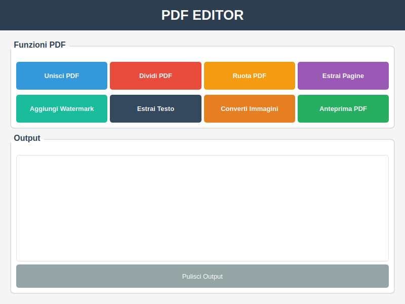

# PDF Editor - Applicazione Desktop Python

Una potente applicazione desktop per modificare file PDF sviluppata in Python con interfaccia grafica moderna basata su **PySide6 (Qt)**, completamente compatibile con Windows 11.



## 🚀 Funzionalità Principali

- **Unione PDF** - Combina più file PDF in un singolo documento
- **Divisione PDF** - Dividi PDF in pagine singole o per intervalli specifici
- **Rotazione PDF** - Ruota le pagine di 90°, 180° o 270°
- **Estrazione Pagine** - Estrai pagine specifiche da un PDF
- **Watermark** - Aggiungi filigrane di testo ai tuoi PDF
- **Estrazione Testo** - Estrai tutto il testo da un PDF in formato .txt
- **Conversione Immagini** - Converti immagini (JPG, PNG, BMP, etc.) in PDF
- **Anteprima PDF** - Visualizza i PDF con l'applicazione predefinita del sistema

## 🔧 Requisiti di Sistema

- **Sistema Operativo**: Windows 10/11
- **Python**: 3.8 o superiore
- **Memoria RAM**: Minimo 2GB
- **Spazio su Disco**: 100MB per l'applicazione + spazio per i file PDF

## 📦 Installazione

### Metodo 1: Installazione Automatica

1. Clona o scarica questo repository
2. Apri il terminale nella cartella del progetto
3. Esegui il comando di installazione:

```bash
pip install -r requirements.txt
```

### Metodo 2: Installazione Manuale

Installa le dipendenze una per una:

```bash
pip install PySide6
pip install pypdf
pip install pillow
pip install pdf2image
pip install reportlab
```

## 🎯 Utilizzo

### Avvio dell'Applicazione

Esegui l'applicazione usando uno di questi metodi:

**Metodo 1 (Più Semplice):**
```bash
# Doppio click su:
avvia_pdf_editor.bat
```

**Metodo 2 (Raccomandato):**
```bash
# Tasto destro → "Esegui con PowerShell":
Avvia_PDF_Editor.ps1
```

**Metodo 3 (Terminale):**
```bash
python pdf_editor.py
```

**Metodo 4 (Sviluppatori):**
```bash
cd src
python main.py
```

### Interfaccia Utente

L'applicazione presenta un'interfaccia grafica moderna e intuitiva con:

- **Pulsanti delle funzioni** - 8 pulsanti colorati con effetti hover per le diverse operazioni
- **Area di output** - Mostra i risultati e i messaggi delle operazioni in tempo reale
- **Design moderno Windows 11** - Interfaccia pulita con angoli arrotondati, ombre e animazioni fluide
- **Temi Qt nativi** - Supporto per i temi del sistema operativo
- **Interfaccia responsive** - Si adatta a diverse risoluzioni dello schermo

### Esempi di Utilizzo

#### Unire più PDF
1. Clicca su "Unisci PDF"
2. Seleziona 2 o più file PDF
3. Scegli il nome del file di output
4. L'operazione verrà completata automaticamente

#### Dividere un PDF
1. Clicca su "Dividi PDF"
2. Seleziona il file PDF da dividere
3. Scegli tra:
   - **Pagine singole** - Ogni pagina diventa un file separato
   - **Intervallo** - Specifica pagina iniziale e finale
4. Seleziona la cartella di output

#### Aggiungere Watermark
1. Clicca su "Aggiungi Watermark"
2. Seleziona il PDF
3. Inserisci il testo del watermark
4. Salva il file con watermark

## 🗂️ Struttura del Progetto

```
PDF-Editor/
├── src/
│   ├── main.py              # Applicazione principale
│   ├── pdf_manager.py       # Gestore delle operazioni PDF
│   └── ui_components.py     # Componenti dell'interfaccia utente
├── assets/                  # Risorse (icone, immagini)
├── output/                  # Cartella di output predefinita
├── requirements.txt         # Dipendenze Python
├── pdf_editor.py           # Script di avvio
└── README.md               # Questa documentazione
```

## 🔧 Tecnologie Utilizzate

- **Python 3.8+** - Linguaggio di programmazione principale
- **PySide6 (Qt)** - Framework moderno per l'interfaccia grafica con supporto nativo Windows 11
- **pypdf** - Libreria per la manipolazione dei PDF
- **Pillow (PIL)** - Gestione delle immagini
- **reportlab** - Creazione di PDF e watermark
- **pdf2image** - Conversione PDF in immagini per l'anteprima

### Perché PySide6?

- ✅ **Interfaccia moderna** - Look and feel nativo di Windows 11
- ✅ **Performance migliorate** - Rendering più veloce e fluido
- ✅ **Temi avanzati** - Supporto completo per temi scuri e chiari
- ✅ **Scalabilità** - Supporto nativo per DPI elevati (4K, 8K)
- ✅ **Cross-platform** - Funziona su Windows, macOS e Linux
- ✅ **Manutenzione attiva** - Libreria Qt mantenuta attivamente

## 🐛 Risoluzione dei Problemi

### Problemi Comuni

**Errore "ModuleNotFoundError"**
```
Soluzione: Installa le dipendenze mancanti
pip install -r requirements.txt
```

**Errore durante l'apertura dell'anteprima**
```
Soluzione: Assicurati di avere un lettore PDF installato (Adobe Acrobat, Edge, etc.)
```

**Problemi con caratteri speciali nei nomi dei file**
```
Soluzione: Evita caratteri speciali nei nomi dei file PDF
```

### Log degli Errori

L'applicazione mostra tutti i messaggi di errore nell'area di output in fondo alla finestra. In caso di problemi:

1. Leggi attentamente il messaggio di errore
2. Controlla che i file PDF non siano danneggiati
3. Verifica di avere i permessi per scrivere nella cartella di output

## 🔄 Aggiornamenti Futuri

Funzionalità in sviluppo:
- [ ] Compressione PDF
- [ ] Protezione con password
- [ ] OCR per il riconoscimento del testo
- [ ] Supporto per batch processing
- [ ] Interfaccia a schede
- [ ] Anteprima integrata

## 📝 Licenza

Questo progetto è rilasciato sotto licenza MIT. Vedi il file LICENSE per i dettagli completi.

## 👨‍💻 Sviluppatore

Sviluppato con ❤️ per Windows

## 🤝 Contribuzioni

I contributi sono benvenuti! Per contribuire:

1. Fai un fork del progetto
2. Crea un branch per la tua funzionalità
3. Committa le modifiche
4. Apri una Pull Request

## 📞 Supporto

Per problemi o domande:
- Apri una issue su GitHub
- Controlla la sezione "Risoluzione dei Problemi"
- Verifica che tutte le dipendenze siano installate correttamente

---

**Nota**: Questa applicazione è ottimizzata per Windows e utilizza l'interfaccia grafica nativa tkinter per garantire compatibilità e prestazioni ottimali.